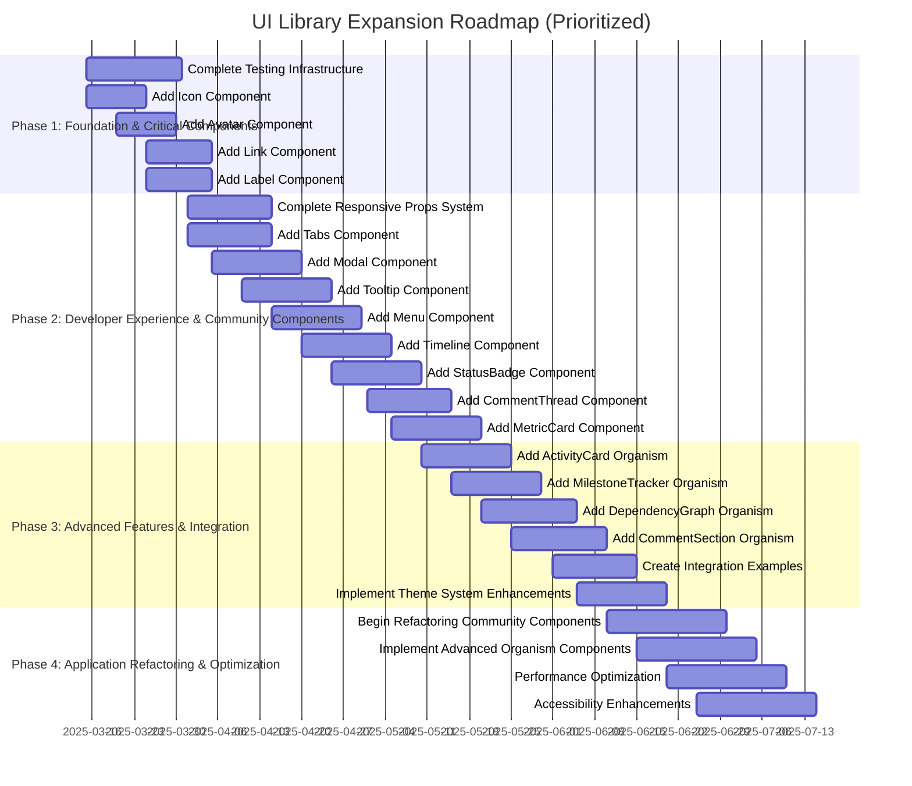

# UI Library Implementation Plan

This document provides a comprehensive implementation plan for the UI component library, including phases, tasks, and future enhancements. For progress tracking, see [Implementation Progress](./implementation-progress.md).

## Overview

The UI library is being developed in phases to ensure a systematic and manageable approach. Each phase focuses on specific aspects of the library, from foundation strengthening to advanced features.

### Application-Specific Priorities

Based on analysis of the application codebase, particularly the community components, we've identified the following high-priority needs:

1. **Community Component Integration**: The community components (CircleView, ActivityDetailView, ActivityLifecycleView, etc.) are complex and would benefit significantly from using the UI library components.

2. **Specialized Components**: Several specialized components are needed for the community features:
   - Timeline Component for activity timelines
   - StatusBadge Component for activity statuses
   - CommentThread Component for nested comments
   - MetricCard Component for displaying metrics

3. **Complex Visualizations**: Components for visualizing dependencies, milestones, and activity lifecycles are needed.

4. **Tabbed Interfaces**: Many community components use tabbed interfaces that could be standardized.

5. **Modal Dialogs**: Several components use modal dialogs for detailed views and forms.

These priorities will guide the implementation plan, ensuring that the most impactful components are developed first.

## Implementation Graph

```mermaid
graph TD
    %% Main UI Library Structure
    UI[UI Library] --> Tokens[Design Tokens]
    UI --> Components[Component Library]
    UI --> Themes[Theme System]
    UI --> Utils[Utilities]
    UI --> Docs[Documentation]
    
    %% Design Tokens Breakdown
    Tokens --> Colors[Colors]
    Tokens --> Typography[Typography]
    Tokens --> Spacing[Spacing]
    Tokens --> Shadows[Shadows]
    Tokens --> Borders[Borders]
    Tokens --> Animations[Animations]
    Tokens --> ZIndex[Z-Index]
    Tokens --> Focus[Focus Styles]
    Tokens --> Transitions[Transition Timing]
    Tokens --> GridTemplates[Grid Templates]
    Tokens --> AspectRatios[Aspect Ratios]
    
    %% Colors Breakdown
    Colors --> CP[Color Palette]
    Colors --> SC[Semantic Colors]
    CP --> Brand[Brand Colors]
    CP --> Accent[Accent Colors]
    CP --> Neutral[Neutral Colors]
    CP --> Status[Status Colors]
    SC --> BG[Background Colors]
    SC --> Text[Text Colors]
    SC --> Border[Border Colors]
    
    %% Component Library Breakdown
    Components --> Atoms[Atomic Components]
    Components --> Molecules[Molecular Components]
    Components --> Organisms[Organism Components]
    
    %% Atomic Components
    Atoms --> Box[Box]
    Atoms --> Flex[Flex]
    Atoms --> Grid[Grid]
    Atoms --> Text[Text]
    Atoms --> Button[Button]
    Atoms --> Badge[Badge]
    Atoms --> Input[Input]
    Atoms --> Stack[Stack]
    Atoms --> Divider[Divider]
    Atoms --> Icon[Icon]
    Atoms --> Avatar[Avatar]
    Atoms --> Link[Link]
    Atoms --> Label[Label]
    Atoms --> Spinner[Spinner/Loader]
    Atoms --> Switch[Switch/Toggle]
    Atoms --> Radio[Radio]
    Atoms --> Image[Image]
    
    %% Molecular Components
    Molecules --> Card[Card]
    Molecules --> Checkbox[Checkbox]
    Molecules --> Select[Select]
    Molecules --> Textarea[Textarea]
    Molecules --> Toast[Toast]
    Molecules --> Accordion[Accordion]
    Molecules --> Alert[Alert]
    Molecules --> Tooltip[Tooltip]
    Molecules --> Modal[Modal]
    Molecules --> Popover[Popover]
    Molecules --> Tabs[Tabs]
    Molecules --> Breadcrumb[Breadcrumb]
    Molecules --> Menu[Menu]
    Molecules --> Dropdown[Dropdown]
    Molecules --> Pagination[Pagination]
    Molecules --> Rating[Rating]
    Molecules --> SearchInput[SearchInput]
    Molecules --> DatePicker[DatePicker]
    Molecules --> TimePicker[TimePicker]
    Molecules --> FileUpload[FileUpload]
    Molecules --> Stepper[Stepper]
    
    %% Organism Components
    Organisms --> Form[Form]
    Organisms --> DataTable[DataTable/Table]
    Organisms --> Calendar[Calendar]
    Organisms --> Navigation[Navigation]
    Organisms --> Sidebar[Sidebar]
    Organisms --> Header[Header]
    Organisms --> Footer[Footer]
    Organisms --> Wizard[Wizard]
    Organisms --> CommentSection[CommentSection]
    Organisms --> UserProfile[UserProfile]
    Organisms --> NotificationCenter[NotificationCenter]
    Organisms --> Dashboard[Dashboard]
    
    %% Theme System
    Themes --> LightTheme[Light Theme]
    Themes --> DarkTheme[Dark Theme]
    Themes --> CustomTheme[Custom Themes]
    Themes --> ThemeProvider[Theme Provider]
    
    %% Utilities
    Utils --> CSSVars[CSS Variables Generator]
    Utils --> CompExtUtils[Component Extension Utilities]
    Utils --> ResponsiveProps[Responsive Props]
    Utils --> Polymorphic[Polymorphic Components]
    
    %% Documentation
    Docs --> TokenDocs[Token Documentation]
    Docs --> CompDocs[Component Documentation]
    Docs --> ThemeDocs[Theme Documentation]
    Docs --> ExtendDocs[Extension Guide]
    Docs --> MigrationDocs[Migration Guide]
    
    %% Implementation Flow
    Implementation[Implementation Flow] --> Phase1[Phase 1: Foundation]
    Implementation --> Phase2[Phase 2: Developer Experience]
    Implementation --> Phase3[Phase 3: Advanced Features]
    Implementation --> Phase4[Phase 4: Application Refactoring]
```



## Phase 1: Foundation Strengthening & Critical Components (March-April 2025)

### Resources Required

- **Time**: 4-6 weeks (2 weeks for component migration, 2 weeks for standardization, 2 weeks for testing)
- **Team Size**: 2-3 developers
- **Skill Set**:
  - React.js (Advanced)
  - CSS/SCSS (Intermediate to Advanced)
  - JavaScript/TypeScript (Advanced)
  - Testing frameworks (Intermediate)
  - Documentation (Intermediate)
- **Technology**:
  - React.js
  - PropTypes or TypeScript
  - Jest and React Testing Library
  - CSS/SCSS
  - JSDoc for documentation
  - Git for version control

### Tasks

#### 1. Complete Component Migration

- Migrate design tokens from design-system to ui
- Migrate theme system from design-system to ui
- Migrate utilities from design-system to ui
- Migrate components from design-system to ui
- Update imports to use the new UI library
- Remove the design-system directory

#### 2. Standardize Component Structure

- Implement consistent file structure for all components
  - ComponentName.js
  - ComponentName.css
  - ComponentName.test.js
  - ComponentName.stories.js
  - index.js
- Add proper PropTypes and documentation to all components
- Create index files for better importing experience

#### 3. Standardize Prop Patterns

- Implement consistent prop patterns across all components
- Ensure similar props work the same way across components
- Add support for common props like margin, padding, etc.
- Document standardized prop patterns

#### 4. Add Testing Infrastructure

- Set up Jest and React Testing Library for component testing
- Add basic tests for all components
- Implement testing utilities for common testing patterns
- Add test coverage reporting

#### 5. Implement Additional Atomic Components

- Create Icon component for consistent icon usage
  - **High Priority**: Needed by community components for status indicators, actions, etc.
- Implement Avatar component for user profiles
  - **High Priority**: Critical for CircleView and ActivityDetailView
- Add Link component for navigation
  - **High Priority**: Needed for all community components
- Create Label component for form accessibility
  - **High Priority**: Required for all form elements in the application

## Phase 2: Developer Experience & Community-Specific Components (April-May 2025)

### Resources Required

- **Time**: 4-6 weeks (1-2 weeks per feature)
- **Team Size**: 2-3 developers
- **Skill Set**:
  - React.js (Advanced)
  - CSS/SCSS (Advanced)
  - JavaScript/TypeScript (Advanced)
  - Component design patterns (Advanced)
  - Documentation (Intermediate to Advanced)
- **Technology**:
  - React.js
  - PropTypes or TypeScript
  - CSS-in-JS libraries (optional)
  - Storybook
  - Git for version control

### Tasks

#### 1. Implement Responsive Props System

- Create a utility for handling responsive props
- Add support for breakpoint-based styling
- Implement responsive variants for all components
- Document responsive props system

#### 2. Enhance Component Composition

- Improve component composition patterns
- Add support for compound components
- Implement render props pattern where appropriate
- Document component composition patterns

#### 3. Implement Polymorphic Components

- Add support for rendering components as different HTML elements
- Implement the `as` prop pattern
- Ensure proper type safety for polymorphic components
- Document polymorphic components

#### 4. Add Storybook

- Install and configure Storybook
- Create stories for all components
- Add documentation and examples to stories
- Configure Storybook addons for better development experience

#### 5. Implement Additional Atomic Components

- Create Spinner/Loader component for loading states
- Implement Switch/Toggle component for boolean settings
- Add Radio component for single-selection options
- Create enhanced Image component with lazy loading and fallbacks

#### 6. Implement Basic Molecular Components

- Create Accordion component for collapsible content
- Implement Alert component for system messages
- Add Tooltip component for contextual help
  - **High Priority**: Useful across all community components
- Add Tabs component for tabbed interfaces
  - **High Priority**: Immediately useful for ActivityDetailView's tab navigation
- Create Modal component for dialogs and popups
  - **High Priority**: Needed for ActivityDetailView, CircleView modals
- Implement Menu component for dropdown menus
  - **High Priority**: Needed for action menus in community components

#### 7. Implement Community-Specific Components

- Create Timeline component for activity timelines
  - **High Priority**: Critical for ActivityLifecycleView
- Implement StatusBadge component for activity statuses
  - **High Priority**: Used across all community components
- Add CommentThread component for nested comments
  - **High Priority**: Needed for CommentSection
- Create MetricCard component for displaying metrics
  - **High Priority**: Used in ActivityLifecycleView and MilestoneDependencyView

## Phase 3: Advanced Features & Integration (May-June 2025)

### Resources Required

- **Time**: 4-6 weeks (1-2 weeks per feature)
- **Team Size**: 3-4 developers (including QA specialist)
- **Skill Set**:
  - React.js (Advanced)
  - Testing frameworks (Advanced)
  - Accessibility (Advanced)
  - Performance optimization (Advanced)
  - CI/CD pipelines (Intermediate to Advanced)
  - Documentation (Advanced)
- **Technology**:
  - Jest and React Testing Library
  - Chromatic for visual testing
  - jest-axe for accessibility testing
  - Webpack Bundle Analyzer
  - GitHub Actions or similar CI/CD tool
  - Netlify, Vercel, or similar for hosting the playground

### Tasks

#### 1. Implement Visual Testing

- Set up visual regression testing with Chromatic
- Create baseline snapshots for all components
- Integrate with CI/CD pipeline
- Document visual testing process

#### 2. Add Accessibility Testing

- Implement accessibility testing with jest-axe
- Add accessibility checks to CI/CD pipeline
- Ensure all components meet WCAG standards
- Document accessibility guidelines

#### 3. Add Performance Monitoring

- Implement performance metrics for components
- Add bundle size monitoring
- Create performance benchmarks
- Document performance optimization techniques

#### 4. Create Component Playground

- Develop an interactive component playground
- Add code examples and live editing
- Include documentation and usage guidelines
- Make the playground publicly accessible

#### 5. Implement Advanced Molecular Components

- Implement Popover component for contextual information
- Create Breadcrumb component for navigation hierarchy
- Add Dropdown component for enhanced selection
- Create Pagination component for data navigation
- Implement Rating component for feedback collection
- Add SearchInput component for enhanced search
- Create DatePicker and TimePicker components
- Implement FileUpload component for file management
- Add Stepper component for multi-step processes

#### 6. Implement Basic Organism Components

- Create DataTable/Table component for structured data
- Implement Calendar component for scheduling
- Add additional token sets for z-index, focus styles, transitions, grid templates, and aspect ratios

#### 7. Implement Community-Specific Organism Components

- Create ActivityCard organism for displaying activities
  - **High Priority**: Core component for CircleView
- Implement MilestoneTracker organism for tracking milestones
  - **High Priority**: Critical for ActivityLifecycleView
- Add DependencyGraph organism for visualizing dependencies
  - **High Priority**: Needed for MilestoneDependencyView
- Create CommentSection organism for comments and discussions
  - **High Priority**: Used across community components

#### 8. Create Integration Examples

- Create example implementations of community components using UI library
- Document integration patterns for different component types
- Create migration guide for existing components

## Phase 4: Application Refactoring & Optimization (June-July 2025)

### Resources Required

- **Time**: 4-6 weeks (1-2 weeks for strategy, 2-3 weeks for refactoring, 1 week for validation)
- **Team Size**: 3-5 developers (including application developers)
- **Skill Set**:
  - React.js (Advanced)
  - Application architecture (Advanced)
  - Refactoring techniques (Advanced)
  - Testing (Advanced)
  - Project management (Intermediate to Advanced)
  - Documentation (Advanced)
- **Technology**:
  - React.js
  - Jest and React Testing Library
  - Code analysis tools
  - Project management tools (Jira, Trello, etc.)
  - Git for version control
  - CI/CD pipeline

### Tasks

#### 1. Create Migration Strategy

- Identify high-impact components to migrate first
- Create a dependency graph to understand migration order
- Develop a phased approach to minimize disruption
- Document migration strategy

#### 2. Refactor Application Components

- Start with shared components used across the application
- Move to feature-specific components
  - Begin with simpler components like ActivityCard
  - Move to more complex components like ActivityDetailView
  - Create reusable patterns for community components
- Update imports and props as needed
- Document refactoring process

#### 3. Validate and Test

- Ensure refactored components work as expected
- Add tests for refactored components
- Monitor performance and accessibility
- Document validation process

#### 4. Implement Advanced Organism Components

- Create Navigation component for application navigation
- Implement Sidebar component for side navigation
- Add Header and Footer components
- Create Wizard component for guided flows
- Implement CommentSection component for discussions
- Add UserProfile component for user information
- Create NotificationCenter component for notifications
- Implement Dashboard component for data visualization

## Future Enhancements (Beyond July 2025)

### Resources Required

- **Time**: Ongoing (3-6 months for initial implementation, continuous improvement afterward)
- **Team Size**: 4-6 developers (including specialists for specific areas)
- **Skill Set**:
  - React.js (Advanced)
  - Data visualization (Advanced for charts and graphs)
  - Animation (Advanced for animation system)
  - Form handling (Advanced for form builder)
  - Internationalization (Advanced for i18n features)
  - Documentation (Advanced)
  - UX/UI design (Advanced)
  - DevOps (Intermediate to Advanced for tooling)
- **Technology**:
  - React.js
  - D3.js or similar for data visualization
  - Framer Motion or similar for animations
  - i18next or similar for internationalization
  - Node.js for developer tools
  - Documentation frameworks (Docusaurus, VitePress, etc.)
  - Design systems (Figma integration)

### Tasks

#### 1. Additional Components

- **Form Components**
  - Radio Button
  - Toggle/Switch
  - Date Picker

- **Layout Components**
  - Container
  - AspectRatio
  - Center
  - SimpleGrid

- **Data Display Components**
  - DataTable
  - Tree
  - Timeline
  - Charts
  - Graphs

- **Navigation Components**
  - Tabs
  - Breadcrumbs
  - Pagination
  - Menu
  - Sidebar

- **Feedback Components**
  - Modal
  - Dialog
  - Tooltip
  - Popover
  - Progress

#### 2. Component Composition Patterns

- Create higher-order components for common patterns
- Implement compound component patterns for related components
- Add context-based component relationships

#### 3. Advanced Interaction Support

- Add support for drag and drop
- Implement focus trapping for modal components
- Add keyboard shortcut support
- Implement touch gesture support

#### 4. Accessibility Improvements

- Add comprehensive ARIA support
- Implement focus management utilities
- Add screen reader announcements for dynamic content
- Implement automated accessibility testing
- Create accessibility audit tools
- Add keyboard navigation testing
- Add high contrast theme

#### 5. Performance Optimizations

- Implement code splitting
- Add dynamic imports for less frequently used components
- Implement tree-shaking optimizations
- Add virtualization for list components
- Implement memoization for expensive calculations
- Optimize re-renders with React.memo and useMemo
- Analyze and reduce bundle size

#### 6. Developer Experience

- Create an interactive component playground
- Add live code editing
- Implement visual testing environment
- Create design token inspector
- Add component inspector
- Implement theme editor

#### 7. Advanced Theming

- Add theme customization UI
- Implement theme export/import
- Create theme presets
- Add support for component-specific theming
- Implement nested themes
- Add theme transition animations

#### 8. Internationalization and Localization

- Enhance RTL support with logical properties
- Add internationalization utilities
- Implement locale-specific formatting
- Add support for different date formats
- Implement number formatting
- Add currency support

## Timeline

```
2025-03 | 2025-04 | 2025-05 | 2025-06 | 2025-07 | 2025-08 | 2025-09
--------|---------|---------|---------|---------|---------|--------
Phase 1: Foundation & Critical Components  |         |         |         |         |         |
         | Phase 2: Developer Experience & Community Components  |         |         |         |         |
         |         | Phase 3: Advanced Features & Integration  |         |         |         |
         |         |         | Phase 4: Application Refactoring & Optimization  |         |         |
         |         |         |         | Future Enhancements -->
```

### Prioritized Implementation Roadmap



## Milestones

1. **Foundation & Critical Components Complete** (End of April 2025)
   - All components migrated
   - Standardized component structure
   - Standardized prop patterns
   - Testing infrastructure in place
   - Critical atomic components implemented (Icon, Avatar, Link, Label)

2. **Developer Experience & Community Components Enhanced** (End of May 2025)
   - Responsive props system implemented
   - Component composition enhanced
   - Polymorphic components implemented
   - Storybook added
   - Basic molecular components implemented (Tabs, Modal, Tooltip, Menu)
   - Community-specific components implemented (Timeline, StatusBadge, CommentThread, MetricCard)

3. **Advanced Features & Integration Implemented** (End of June 2025)
   - Visual testing implemented
   - Accessibility testing added
   - Performance monitoring added
   - Component playground created
   - Community-specific organism components implemented (ActivityCard, MilestoneTracker, DependencyGraph, CommentSection)
   - Integration examples created

4. **Application Refactored & Optimized** (End of July 2025)
   - Migration strategy created
   - Application components refactored
   - Performance optimized
   - Accessibility enhanced
   - Validation and testing complete

5. **Future Enhancements** (Beyond July 2025)
   - Additional components added
   - Advanced features implemented
   - Developer tools created

## Implementation Strategy

To implement these improvements effectively:

1. **Prioritize based on impact**: Focus on improvements that will have the most significant impact on the application.
   - Prioritize components needed by the community features
   - Focus on components that can be reused across multiple parts of the application
   - Address pain points in the current implementation first

2. **Implement incrementally**: Add improvements gradually to avoid disrupting the existing system.
   - Start with atomic components and build up to more complex components
   - Implement one component at a time and ensure it works properly before moving on
   - Create integration examples for each component

3. **Test thoroughly**: Ensure each improvement is thoroughly tested before integration.
   - Write comprehensive tests for all components
   - Test components in isolation and in combination
   - Test accessibility and performance

4. **Document changes**: Keep documentation up-to-date with all improvements.
   - Update documentation as components are implemented
   - Create usage examples for each component
   - Document integration patterns

5. **Gather feedback**: Continuously collect feedback from developers using the system.
   - Get feedback on component APIs and usability
   - Iterate based on feedback
   - Prioritize improvements based on developer needs

### Integration Strategy

To ensure smooth integration of the UI library into the application, we recommend the following approach:

1. **Start with Atomic Components**: Begin by replacing basic HTML elements with atomic components like Box, Text, and Button.

2. **Move to Molecular Components**: Replace simple component combinations with molecular components like Card, Tabs, and Modal.

3. **Implement Organism Components**: Replace complex component combinations with organism components like Form, ActivityCard, and CommentSection.

4. **Refactor Page by Page**: Start with simpler pages and move to more complex ones.

5. **Use Codemods for Bulk Changes**: Create codemods to automate repetitive changes.

### Example Integration: ActivityDetailView

Here's an example of how the ActivityDetailView component could be refactored to use the UI library:

```jsx
// Before
<div className="activity-detail-view">
  <div className="detail-header">
    <div className="header-content">
      <div className="type-status">
        <span className={`activity-type ${activity.type}`}>
          {activity.type}
        </span>
        <span className={`activity-status ${activity.status}`}>
          {activity.status}
        </span>
      </div>
      <h2>{activity.title}</h2>
      <p className="creation-date">
        Created {new Date(activity.createdAt).toLocaleDateString()}
      </p>
    </div>
    <button 
      className="close-button"
      onClick={onClose}
    >
      ×
    </button>
  </div>

  <div className="tab-navigation">
    {tabs.map(tab => (
      <button
        key={tab.id}
        className={`tab-button ${activeTab === tab.id ? 'active' : ''}`}
        onClick={() => setActiveTab(tab.id)}
      >
        {tab.label}
      </button>
    ))}
  </div>

  <div className="detail-content">
    {/* Tab content */}
  </div>
</div>

// After
<Box className="activity-detail-view">
  <Flex justifyContent="space-between" alignItems="center" className="detail-header">
    <Box className="header-content">
      <Flex gap="sm" className="type-status">
        <Badge variant={activity.type}>{activity.type}</Badge>
        <Badge variant={activity.status}>{activity.status}</Badge>
      </Flex>
      <Text variant="h2">{activity.title}</Text>
      <Text variant="caption" className="creation-date">
        Created {new Date(activity.createdAt).toLocaleDateString()}
      </Text>
    </Box>
    <Button 
      variant="icon"
      onClick={onClose}
      aria-label="Close"
    >
      <Icon name="close" />
    </Button>
  </Flex>

  <Tabs activeTab={activeTab} onChange={setActiveTab}>
    <Tabs.List>
      {tabs.map(tab => (
        <Tabs.Tab key={tab.id} id={tab.id}>
          {tab.label}
        </Tabs.Tab>
      ))}
    </Tabs.List>
    
    <Tabs.Panel id="description">
      {/* Description content */}
    </Tabs.Panel>
    
    <Tabs.Panel id="details">
      {/* Details content */}
    </Tabs.Panel>
    
    {/* Other tab panels */}
  </Tabs>
</Box>
```

## Potential Blockers and Mitigation Strategies

| Potential Blocker | Impact | Mitigation Strategy |
|-------------------|--------|---------------------|
| **CSS Conflicts** | Existing CSS may conflict with new UI library | Use namespacing for all UI library classes; gradually migrate components |
| **Browser Compatibility** | CSS variables not supported in older browsers | Include fallbacks for critical styles; consider using PostCSS for compatibility |
| **Performance Impact** | Additional JS for theming could impact performance | Optimize theme switching; use code splitting; measure performance before/after |
| **Migration Complexity** | Complex components may be difficult to migrate | Start with simpler components; create detailed migration plan for complex ones |
| **Testing Coverage** | Ensuring all components work in all themes | Create automated tests for theme compatibility; visual regression testing |
| **Documentation Maintenance** | Keeping documentation in sync with implementation | Automate documentation where possible; include documentation in code reviews |

## Progress Tracking Tools

Progress will be tracked through:

- GitHub issues and milestones
- Regular status updates
- Documentation updates
- Release notes
- Weekly team meetings
- Monthly progress reports

For detailed progress tracking, see [Implementation Progress](./implementation-progress.md).

## Contributing to the Roadmap

If you have suggestions for the roadmap, please follow these steps:

1. Review the existing roadmap
2. Identify gaps or areas for improvement
3. Submit a proposal with:
   - Description of the feature or improvement
   - Justification for its inclusion
   - Estimated effort and impact
   - Suggested timeline

## Conclusion

This implementation plan provides a comprehensive roadmap for developing and enhancing the UI component library. By following this plan, we can create a robust, maintainable, and user-friendly UI library that meets the needs of the application and its users.
