# UI Library Implementation Plan

This document provides a comprehensive implementation plan for the UI component library, including phases, tasks, progress tracking, and future enhancements.

## Overview

The UI library is being developed in phases to ensure a systematic and manageable approach. Each phase focuses on specific aspects of the library, from foundation strengthening to advanced features.

## Implementation Graph

```mermaid
graph TD
    %% Main UI Library Structure
    UI[UI Library] --> Tokens[Design Tokens]
    UI --> Components[Component Library]
    UI --> Themes[Theme System]
    UI --> Utils[Utilities]
    UI --> Docs[Documentation]
    
    %% Design Tokens Breakdown
    Tokens --> Colors[Colors]
    Tokens --> Typography[Typography]
    Tokens --> Spacing[Spacing]
    Tokens --> Shadows[Shadows]
    Tokens --> Borders[Borders]
    Tokens --> Animations[Animations]
    
    %% Colors Breakdown
    Colors --> CP[Color Palette]
    Colors --> SC[Semantic Colors]
    CP --> Brand[Brand Colors]
    CP --> Accent[Accent Colors]
    CP --> Neutral[Neutral Colors]
    CP --> Status[Status Colors]
    SC --> BG[Background Colors]
    SC --> Text[Text Colors]
    SC --> Border[Border Colors]
    
    %% Component Library Breakdown
    Components --> Atoms[Atomic Components]
    Components --> Molecules[Molecular Components]
    Components --> Organisms[Organism Components]
    
    %% Atomic Components
    Atoms --> Box[Box]
    Atoms --> Flex[Flex]
    Atoms --> Grid[Grid]
    Atoms --> Text[Text]
    Atoms --> Button[Button]
    Atoms --> Badge[Badge]
    Atoms --> Input[Input]
    Atoms --> Stack[Stack]
    Atoms --> Divider[Divider]
    
    %% Molecular Components
    Molecules --> Card[Card]
    Molecules --> Checkbox[Checkbox]
    Molecules --> Select[Select]
    Molecules --> Textarea[Textarea]
    Molecules --> Toast[Toast]
    
    %% Organism Components
    Organisms --> Form[Form]
    
    %% Theme System
    Themes --> LightTheme[Light Theme]
    Themes --> DarkTheme[Dark Theme]
    Themes --> CustomTheme[Custom Themes]
    Themes --> ThemeProvider[Theme Provider]
    
    %% Utilities
    Utils --> CSSVars[CSS Variables Generator]
    Utils --> CompExtUtils[Component Extension Utilities]
    Utils --> ResponsiveProps[Responsive Props]
    Utils --> Polymorphic[Polymorphic Components]
    
    %% Documentation
    Docs --> TokenDocs[Token Documentation]
    Docs --> CompDocs[Component Documentation]
    Docs --> ThemeDocs[Theme Documentation]
    Docs --> ExtendDocs[Extension Guide]
    Docs --> MigrationDocs[Migration Guide]
    
    %% Implementation Flow
    Implementation[Implementation Flow] --> Phase1[Phase 1: Foundation]
    Implementation --> Phase2[Phase 2: Developer Experience]
    Implementation --> Phase3[Phase 3: Advanced Features]
    Implementation --> Phase4[Phase 4: Application Refactoring]
```



## Phase 1: Foundation Strengthening (March-April 2025)

### Resources Required

- **Time**: 4-6 weeks (2 weeks for component migration, 2 weeks for standardization, 2 weeks for testing)
- **Team Size**: 2-3 developers
- **Skill Set**:
  - React.js (Advanced)
  - CSS/SCSS (Intermediate to Advanced)
  - JavaScript/TypeScript (Advanced)
  - Testing frameworks (Intermediate)
  - Documentation (Intermediate)
- **Technology**:
  - React.js
  - PropTypes or TypeScript
  - Jest and React Testing Library
  - CSS/SCSS
  - JSDoc for documentation
  - Git for version control

### Tasks

#### 1. Complete Component Migration

- ✅ Migrate design tokens from design-system to ui
- ✅ Migrate theme system from design-system to ui
- ✅ Migrate utilities from design-system to ui
- ✅ Migrate components from design-system to ui
- ✅ Update imports to use the new UI library
- ✅ Remove the design-system directory

#### 2. Standardize Component Structure

- Implement consistent file structure for all components
  - ComponentName.js
  - ComponentName.css
  - ComponentName.test.js
  - ComponentName.stories.js
  - index.js
- Add proper PropTypes and documentation to all components
- Create index files for better importing experience

#### 3. Standardize Prop Patterns

- Implement consistent prop patterns across all components
- Ensure similar props work the same way across components
- Add support for common props like margin, padding, etc.
- Document standardized prop patterns

#### 4. Add Testing Infrastructure

- Set up Jest and React Testing Library for component testing
- Add basic tests for all components
- Implement testing utilities for common testing patterns
- Add test coverage reporting

## Phase 2: Developer Experience Improvements (April-May 2025)

### Resources Required

- **Time**: 4-6 weeks (1-2 weeks per feature)
- **Team Size**: 2-3 developers
- **Skill Set**:
  - React.js (Advanced)
  - CSS/SCSS (Advanced)
  - JavaScript/TypeScript (Advanced)
  - Component design patterns (Advanced)
  - Documentation (Intermediate to Advanced)
- **Technology**:
  - React.js
  - PropTypes or TypeScript
  - CSS-in-JS libraries (optional)
  - Storybook
  - Git for version control

### Tasks

#### 1. Implement Responsive Props System

- Create a utility for handling responsive props
- Add support for breakpoint-based styling
- Implement responsive variants for all components
- Document responsive props system

#### 2. Enhance Component Composition

- Improve component composition patterns
- Add support for compound components
- Implement render props pattern where appropriate
- Document component composition patterns

#### 3. Implement Polymorphic Components

- Add support for rendering components as different HTML elements
- Implement the `as` prop pattern
- Ensure proper type safety for polymorphic components
- Document polymorphic components

#### 4. Add Storybook

- Install and configure Storybook
- Create stories for all components
- Add documentation and examples to stories
- Configure Storybook addons for better development experience

## Phase 3: Advanced Features (May-June 2025)

### Resources Required

- **Time**: 4-6 weeks (1-2 weeks per feature)
- **Team Size**: 3-4 developers (including QA specialist)
- **Skill Set**:
  - React.js (Advanced)
  - Testing frameworks (Advanced)
  - Accessibility (Advanced)
  - Performance optimization (Advanced)
  - CI/CD pipelines (Intermediate to Advanced)
  - Documentation (Advanced)
- **Technology**:
  - Jest and React Testing Library
  - Chromatic for visual testing
  - jest-axe for accessibility testing
  - Webpack Bundle Analyzer
  - GitHub Actions or similar CI/CD tool
  - Netlify, Vercel, or similar for hosting the playground

### Tasks

#### 1. Implement Visual Testing

- Set up visual regression testing with Chromatic
- Create baseline snapshots for all components
- Integrate with CI/CD pipeline
- Document visual testing process

#### 2. Add Accessibility Testing

- Implement accessibility testing with jest-axe
- Add accessibility checks to CI/CD pipeline
- Ensure all components meet WCAG standards
- Document accessibility guidelines

#### 3. Add Performance Monitoring

- Implement performance metrics for components
- Add bundle size monitoring
- Create performance benchmarks
- Document performance optimization techniques

#### 4. Create Component Playground

- Develop an interactive component playground
- Add code examples and live editing
- Include documentation and usage guidelines
- Make the playground publicly accessible

## Phase 4: Application Refactoring (June-July 2025)

### Resources Required

- **Time**: 4-6 weeks (1-2 weeks for strategy, 2-3 weeks for refactoring, 1 week for validation)
- **Team Size**: 3-5 developers (including application developers)
- **Skill Set**:
  - React.js (Advanced)
  - Application architecture (Advanced)
  - Refactoring techniques (Advanced)
  - Testing (Advanced)
  - Project management (Intermediate to Advanced)
  - Documentation (Advanced)
- **Technology**:
  - React.js
  - Jest and React Testing Library
  - Code analysis tools
  - Project management tools (Jira, Trello, etc.)
  - Git for version control
  - CI/CD pipeline

### Tasks

#### 1. Create Migration Strategy

- Identify high-impact components to migrate first
- Create a dependency graph to understand migration order
- Develop a phased approach to minimize disruption
- Document migration strategy

#### 2. Refactor Application Components

- Start with shared components used across the application
- Move to feature-specific components
- Update imports and props as needed
- Document refactoring process

#### 3. Validate and Test

- Ensure refactored components work as expected
- Add tests for refactored components
- Monitor performance and accessibility
- Document validation process

## Future Enhancements (Beyond July 2025)

### Resources Required

- **Time**: Ongoing (3-6 months for initial implementation, continuous improvement afterward)
- **Team Size**: 4-6 developers (including specialists for specific areas)
- **Skill Set**:
  - React.js (Advanced)
  - Data visualization (Advanced for charts and graphs)
  - Animation (Advanced for animation system)
  - Form handling (Advanced for form builder)
  - Internationalization (Advanced for i18n features)
  - Documentation (Advanced)
  - UX/UI design (Advanced)
  - DevOps (Intermediate to Advanced for tooling)
- **Technology**:
  - React.js
  - D3.js or similar for data visualization
  - Framer Motion or similar for animations
  - i18next or similar for internationalization
  - Node.js for developer tools
  - Documentation frameworks (Docusaurus, VitePress, etc.)
  - Design systems (Figma integration)

### Tasks

#### 1. Additional Components

- **Form Components**
  - Radio Button
  - Toggle/Switch
  - Date Picker

- **Layout Components**
  - Container
  - AspectRatio
  - Center
  - SimpleGrid

- **Data Display Components**
  - DataTable
  - Tree
  - Timeline
  - Charts
  - Graphs

- **Navigation Components**
  - Tabs
  - Breadcrumbs
  - Pagination
  - Menu
  - Sidebar

- **Feedback Components**
  - Modal
  - Dialog
  - Tooltip
  - Popover
  - Progress

#### 2. Component Composition Patterns

- Create higher-order components for common patterns
- Implement compound component patterns for related components
- Add context-based component relationships

#### 3. Advanced Interaction Support

- Add support for drag and drop
- Implement focus trapping for modal components
- Add keyboard shortcut support
- Implement touch gesture support

#### 4. Accessibility Improvements

- Add comprehensive ARIA support
- Implement focus management utilities
- Add screen reader announcements for dynamic content
- Implement automated accessibility testing
- Create accessibility audit tools
- Add keyboard navigation testing
- Add high contrast theme

#### 5. Performance Optimizations

- Implement code splitting
- Add dynamic imports for less frequently used components
- Implement tree-shaking optimizations
- Add virtualization for list components
- Implement memoization for expensive calculations
- Optimize re-renders with React.memo and useMemo
- Analyze and reduce bundle size

#### 6. Developer Experience

- Create an interactive component playground
- Add live code editing
- Implement visual testing environment
- Create design token inspector
- Add component inspector
- Implement theme editor

#### 7. Advanced Theming

- Add theme customization UI
- Implement theme export/import
- Create theme presets
- Add support for component-specific theming
- Implement nested themes
- Add theme transition animations

#### 8. Internationalization and Localization

- Enhance RTL support with logical properties
- Add internationalization utilities
- Implement locale-specific formatting
- Add support for different date formats
- Implement number formatting
- Add currency support

## Timeline

```
2025-03 | 2025-04 | 2025-05 | 2025-06 | 2025-07 | 2025-08 | 2025-09
--------|---------|---------|---------|---------|---------|--------
Phase 1  |         |         |         |         |         |
         | Phase 2  |         |         |         |         |
         |         | Phase 3  |         |         |         |
         |         |         | Phase 4  |         |         |
         |         |         |         | Future Enhancements -->
```

## Milestones

1. **Foundation Complete** (End of April 2025)
   - All components migrated
   - Standardized component structure
   - Standardized prop patterns
   - Testing infrastructure in place

2. **Developer Experience Enhanced** (End of May 2025)
   - Responsive props system implemented
   - Component composition enhanced
   - Polymorphic components implemented
   - Storybook added

3. **Advanced Features Implemented** (End of June 2025)
   - Visual testing implemented
   - Accessibility testing added
   - Performance monitoring added
   - Component playground created

4. **Application Refactored** (End of July 2025)
   - Migration strategy created
   - Application components refactored
   - Validation and testing complete

5. **Future Enhancements** (Beyond July 2025)
   - Additional components added
   - Advanced features implemented
   - Developer tools created

## Progress Tracking

### Interactive Task Tracker

Use this section to track progress on specific tasks. Update the checkboxes as tasks are completed.

#### Phase 1: Foundation Strengthening

##### Component Migration
- [x] Migrate design tokens from design-system to ui
- [x] Migrate theme system from design-system to ui
- [x] Migrate utilities from design-system to ui
- [x] Migrate components from design-system to ui
- [x] Update imports to use the new UI library
- [x] Remove the design-system directory

##### Standardize Component Structure
- [x] Define consistent file structure for components
- [x] Implement file structure for atomic components
- [ ] Implement file structure for molecular components
- [ ] Implement file structure for organism components
- [x] Add proper PropTypes to all components
- [x] Add JSDoc documentation to all components
- [x] Create index files for better importing experience

##### Standardize Prop Patterns
- [x] Define consistent prop patterns
- [x] Implement common props (margin, padding, etc.)
- [x] Ensure similar props work the same way across components
- [x] Document standardized prop patterns

##### Add Testing Infrastructure
- [x] Set up Jest and React Testing Library
- [x] Create testing utilities
- [x] Add basic tests for atomic components
- [ ] Add basic tests for molecular components
- [ ] Add basic tests for organism components
- [ ] Add test coverage reporting

#### Phase 2: Developer Experience Improvements

##### Responsive Props System
- [ ] Create responsive props utility
- [ ] Add breakpoint-based styling support
- [ ] Implement responsive variants for atomic components
- [ ] Implement responsive variants for molecular components
- [ ] Implement responsive variants for organism components
- [ ] Document responsive props system

##### Component Composition
- [ ] Define component composition patterns
- [ ] Add support for compound components
- [ ] Implement render props pattern where appropriate
- [ ] Document component composition patterns

##### Polymorphic Components
- [ ] Create polymorphic component utility
- [ ] Implement the `as` prop pattern
- [ ] Ensure proper type safety for polymorphic components
- [ ] Document polymorphic components

##### Storybook
- [ ] Install and configure Storybook
- [ ] Create stories for atomic components
- [ ] Create stories for molecular components
- [ ] Create stories for organism components
- [ ] Add documentation to stories
- [ ] Configure Storybook addons

#### Phase 3: Advanced Features

##### Visual Testing
- [ ] Set up visual regression testing with Chromatic
- [ ] Create baseline snapshots for atomic components
- [ ] Create baseline snapshots for molecular components
- [ ] Create baseline snapshots for organism components
- [ ] Integrate with CI/CD pipeline
- [ ] Document visual testing process

##### Accessibility Testing
- [ ] Implement accessibility testing with jest-axe
- [ ] Add accessibility checks to CI/CD pipeline
- [ ] Audit components for WCAG compliance
- [ ] Fix accessibility issues
- [ ] Document accessibility guidelines

##### Performance Monitoring
- [ ] Implement performance metrics for components
- [ ] Add bundle size monitoring
- [ ] Create performance benchmarks
- [ ] Optimize component rendering
- [ ] Document performance optimization techniques

##### Component Playground
- [ ] Set up playground infrastructure
- [ ] Develop interactive component examples
- [ ] Add code examples and live editing
- [ ] Include documentation and usage guidelines
- [ ] Deploy playground to public URL

#### Phase 4: Application Refactoring

##### Migration Strategy
- [ ] Identify high-impact components to migrate first
- [ ] Create dependency graph
- [ ] Develop phased migration approach
- [ ] Document migration strategy

##### Refactor Application Components
- [ ] Refactor shared components
- [ ] Refactor feature-specific components
- [ ] Update imports and props
- [ ] Document refactoring process

##### Validation and Testing
- [ ] Test refactored components
- [ ] Monitor performance metrics
- [ ] Verify accessibility compliance
- [ ] Document validation results

### Progress Visualization

```
# Phase 1: Foundation Strengthening
Component Migration          [====================] 100%
Standardize Component Structure [==================] 90%
Standardize Prop Patterns    [====================] 100%
Add Testing Infrastructure   [==========          ] 50%
Overall Phase 1 Progress     [===============     ] 75%

# Phase 2: Developer Experience Improvements
Responsive Props System      [==========          ] 50%
Component Composition        [=====               ] 25%
Polymorphic Components       [==========          ] 50%
Storybook                    [=====               ] 25%
Overall Phase 2 Progress     [=======             ] 35%

# Phase 3: Advanced Features
Visual Testing               [                    ] 0%
Accessibility Testing        [                    ] 0%
Performance Monitoring       [                    ] 0%
Component Playground         [                    ] 0%
Overall Phase 3 Progress     [                    ] 0%

# Phase 4: Application Refactoring
Migration Strategy           [                    ] 0%
Refactor Application Components [                 ] 0%
Validation and Testing       [                    ] 0%
Overall Phase 4 Progress     [                    ] 0%

# Overall Project Progress    [======              ] 30%
```

### Task Assignment Table

| Task | Assigned To | Priority | Due Date | Status | Notes |
|------|-------------|----------|----------|--------|-------|
| Define consistent file structure | | High | 2025-04-05 | Completed | Standardized structure for all atomic components |
| Implement file structure for atomic components | | High | 2025-04-10 | Completed | All atomic components now follow the standardized structure |
| Create responsive props utility | | High | 2025-04-20 | In Progress | Implemented in Box, Flex, Grid, Text, Button, Badge, Input, Stack, and Divider |
| Create polymorphic component utility | | High | 2025-05-01 | In Progress | Implemented in Box, Flex, Grid, Text, Button, Badge, Input, Stack, and Divider |
| Set up Jest and React Testing Library | | Medium | 2025-04-15 | Completed | Testing infrastructure is in place |
| Add tests for atomic components | | Medium | 2025-04-20 | Completed | All atomic components have comprehensive tests |
| Fix CSS linting issues | | Medium | 2025-04-25 | Completed | Fixed empty rulesets and vendor prefix issues |
| Implement file structure for molecular components | | High | 2025-04-30 | Not Started | |
| Install and configure Storybook | | Medium | 2025-05-10 | In Progress | Stories created for atomic components |
| Set up visual regression testing | | High | 2025-05-15 | Not Started | |
| Implement accessibility testing | | High | 2025-05-20 | Not Started | |
| Develop component playground | | Medium | 2025-06-10 | Not Started | |
| Create migration strategy | | High | 2025-06-15 | Not Started | |
| Begin application refactoring | | High | 2025-06-25 | Not Started | |

## Implementation Strategy

To implement these improvements effectively:

1. **Prioritize based on impact**: Focus on improvements that will have the most significant impact on the application.

2. **Implement incrementally**: Add improvements gradually to avoid disrupting the existing system.

3. **Test thoroughly**: Ensure each improvement is thoroughly tested before integration.

4. **Document changes**: Keep documentation up-to-date with all improvements.

5. **Gather feedback**: Continuously collect feedback from developers using the system.

## Potential Blockers and Mitigation Strategies

| Potential Blocker | Impact | Mitigation Strategy |
|-------------------|--------|---------------------|
| **CSS Conflicts** | Existing CSS may conflict with new UI library | Use namespacing for all UI library classes; gradually migrate components |
| **Browser Compatibility** | CSS variables not supported in older browsers | Include fallbacks for critical styles; consider using PostCSS for compatibility |
| **Performance Impact** | Additional JS for theming could impact performance | Optimize theme switching; use code splitting; measure performance before/after |
| **Migration Complexity** | Complex components may be difficult to migrate | Start with simpler components; create detailed migration plan for complex ones |
| **Testing Coverage** | Ensuring all components work in all themes | Create automated tests for theme compatibility; visual regression testing |
| **Documentation Maintenance** | Keeping documentation in sync with implementation | Automate documentation where possible; include documentation in code reviews |

## Progress Tracking Tools

In addition to this document, progress will be tracked through:

- GitHub issues and milestones
- Regular status updates
- Documentation updates
- Release notes
- Weekly team meetings
- Monthly progress reports

## Contributing to the Roadmap

If you have suggestions for the roadmap, please follow these steps:

1. Review the existing roadmap
2. Identify gaps or areas for improvement
3. Submit a proposal with:
   - Description of the feature or improvement
   - Justification for its inclusion
   - Estimated effort and impact
   - Suggested timeline

## Conclusion

This implementation plan provides a comprehensive roadmap for developing and enhancing the UI component library. By following this plan, we can create a robust, maintainable, and user-friendly UI library that meets the needs of the application and its users.
