# Design System Implementation Plan

This document outlines the implementation plan for the design system, including tasks, progress tracking, potential blockers, and relevant details.

## Implementation Graph

```mermaid
graph TD
    %% Main Design System Structure
    DS[Design System] --> Tokens[Design Tokens]
    DS --> Components[Component Library]
    DS --> Themes[Theme System]
    DS --> Utils[Utilities]
    DS --> Docs[Documentation]
    
    %% Design Tokens Breakdown
    Tokens --> Colors[Colors]
    Tokens --> Typography[Typography]
    Tokens --> Spacing[Spacing]
    Tokens --> Shadows[Shadows]
    Tokens --> Borders[Borders]
    Tokens --> Animations[Animations]
    
    %% Colors Breakdown
    Colors --> CP[Color Palette]
    Colors --> SC[Semantic Colors]
    CP --> Brand[Brand Colors]
    CP --> Accent[Accent Colors]
    CP --> Neutral[Neutral Colors]
    CP --> Status[Status Colors]
    SC --> BG[Background Colors]
    SC --> Text[Text Colors]
    SC --> Border[Border Colors]
    
    %% Component Library Breakdown
    Components --> BaseComp[Base Components]
    Components --> CompVar[Component Variations]
    Components --> CompExt[Component Extensions]
    
    %% Base Components
    BaseComp --> Button[Button]
    BaseComp --> Card[Card]
    BaseComp --> Badge[Badge]
    BaseComp --> Input[Input]
    BaseComp --> Typography[Typography Components]
    
    %% Component Variations
    CompVar --> ButtonVar[Button Variants]
    CompVar --> CardVar[Card Variants]
    CompVar --> BadgeVar[Badge Variants]
    
    %% Theme System
    Themes --> LightTheme[Light Theme]
    Themes --> DarkTheme[Dark Theme]
    Themes --> CustomTheme[Custom Themes]
    Themes --> ThemeProvider[Theme Provider]
    
    %% Utilities
    Utils --> CSSVars[CSS Variables Generator]
    Utils --> CompExtUtils[Component Extension Utilities]
    Utils --> ColorUtils[Color Utilities]
    Utils --> ResponsiveUtils[Responsive Utilities]
    
    %% Documentation
    Docs --> TokenDocs[Token Documentation]
    Docs --> CompDocs[Component Documentation]
    Docs --> ThemeDocs[Theme Documentation]
    Docs --> ExtendDocs[Extension Guide]
    Docs --> MigrationDocs[Migration Guide]
    
    %% Implementation Flow
    Implementation[Implementation Flow] --> Phase1[Phase 1: Foundation]
    Implementation --> Phase2[Phase 2: Component System]
    Implementation --> Phase3[Phase 3: Migration]
    Implementation --> Phase4[Phase 4: Documentation]
```

## Implementation Checklist

### Phase 0: Preparation
- [x] Create Git Branch (`design-system-implementation`) - 2025-04-03
- [x] Create directory structure - 2025-04-03
- [x] Create main README.md - 2025-04-03
- [x] Create implementation plan document - 2025-04-03

### Phase 1: Design System Foundation
- [x] **Design Token System** - 2025-04-03
  - [x] **Colors** - 2025-04-03
    - [x] Extract existing color variables from CSS files - 2025-04-03
    - [x] Create color palette with consistent naming - 2025-04-03
    - [x] Define semantic color assignments - 2025-04-03
    - [x] Document color usage guidelines - 2025-04-03
  
  - [x] **Typography** - 2025-04-03
    - [x] Extract existing typography styles - 2025-04-03
    - [x] Create typography scale - 2025-04-03
    - [x] Define font families, sizes, weights, and line heights - 2025-04-03
    - [x] Document typography usage guidelines - 2025-04-03
  
  - [x] **Spacing** - 2025-04-03
    - [x] Define spacing scale - 2025-04-03
    - [x] Document spacing usage guidelines - 2025-04-03
  
  - [x] **Shadows** - 2025-04-03
    - [x] Extract existing shadow styles - 2025-04-03
    - [x] Create shadow scale - 2025-04-03
    - [x] Document shadow usage guidelines - 2025-04-03
  
  - [x] **Borders** - 2025-04-03
    - [x] Define border widths, styles, and radii - 2025-04-03
    - [x] Document border usage guidelines - 2025-04-03
  
  - [x] **Animations** - 2025-04-03
    - [x] Extract existing animation styles - 2025-04-03
    - [x] Define animation durations and easing functions - 2025-04-03
    - [x] Document animation usage guidelines - 2025-04-03

- [x] **CSS Variables Generator** - 2025-04-03
  - [x] Create utility to generate CSS variables from token system - 2025-04-03
  - [x] Implement flattening function for nested token objects - 2025-04-03
  - [x] Create export mechanism for CSS and JS usage - 2025-04-03

- [x] **Theme System** - 2025-04-03
  - [x] Create light theme definition - 2025-04-03
  - [x] Create dark theme definition - 2025-04-03
  - [x] Implement theme provider component - 2025-04-03
  - [x] Create theme registration mechanism - 2025-04-03
  - [x] Test theme switching functionality - 2025-04-03

### Phase 2: Component System
- [x] **Component Architecture** - 2025-04-03
  - [x] Define component structure and conventions - 2025-04-03
  - [x] Create base component templates - 2025-04-03
  - [x] Implement prop type validation - 2025-04-03
  - [x] Set up component documentation structure - 2025-04-03

- [x] **Component Variation System** - 2025-04-03
  - [x] Create variation registration mechanism - 2025-04-03
  - [x] Implement variant props and default props - 2025-04-03
  - [x] Create style generation for variants - 2025-04-03
  - [x] Test variant switching - 2025-04-03

- [x] **Component Extension System** - 2025-04-03
  - [x] Create extension registration mechanism - 2025-04-03
  - [x] Implement extension hooks - 2025-04-03
  - [x] Create documentation for extending components - 2025-04-03

- [x] **Base Components** - 2025-04-03
  - [x] **Button Component** - 2025-04-03
    - [x] Implement base Button component - 2025-04-03
    - [x] Create button variants (primary, secondary, accent, etc.) - 2025-04-03
    - [x] Implement size variations - 2025-04-03
    - [x] Document Button component - 2025-04-03
  
  - [x] **Card Component** - 2025-04-03
    - [x] Implement base Card component - 2025-04-03
    - [x] Create card variants - 2025-04-03
    - [x] Add header and footer support - 2025-04-03
    - [x] Document Card component - 2025-04-03
  
  - [x] **Badge Component** - 2025-04-03
    - [x] Implement base Badge component - 2025-04-03
    - [x] Create badge variants (status, role, etc.) - 2025-04-03
    - [x] Document Badge component - 2025-04-03
  
  - [x] **Input Component** - 2025-04-03
    - [x] Implement base Input component - 2025-04-03
    - [x] Create input variants - 2025-04-03
    - [x] Add validation support - 2025-04-03
    - [x] Document Input component - 2025-04-03

### Phase 3: Migration
- [ ] **Shared Components**
  - [ ] Identify all shared components
  - [ ] Prioritize components for migration
  - [ ] Refactor shared components to use design system
  - [ ] Test refactored components

- [ ] **CSS Updates**
  - [ ] Update component CSS to use design tokens
  - [ ] Remove hardcoded values
  - [ ] Test styling in different viewports

- [ ] **Theme Testing**
  - [x] Test all components in light theme - 2025-04-03
  - [x] Test all components in dark theme - 2025-04-03
  - [ ] Create custom theme for testing
  - [ ] Fix any theme-related issues

### Phase 4: Documentation
- [x] **Design System Documentation** - 2025-04-03
  - [x] Create overview documentation - 2025-04-03
  - [x] Document token usage - 2025-04-03
  - [x] Document component usage - 2025-04-03
  - [x] Create theme documentation - 2025-04-03
  - [x] Document extension patterns - 2025-04-03

- [ ] **Examples**
  - [x] Create example of adding new design tokens - 2025-04-03
  - [x] Create example of adding component variants - 2025-04-03
  - [x] Create example of creating custom theme - 2025-04-03
  - [ ] Document examples

## Progress Summary (Last Updated: 2025-04-03)

| Phase | Status | Progress |
|-------|--------|----------|
| Phase 0: Preparation | Completed | 100% |
| Phase 1: Foundation | Completed | 100% |
| Phase 2: Component System | Completed | 100% |
| Phase 3: Migration | Not Started | 0% |
| Phase 4: Documentation | In Progress | 90% |

## Current Priorities (2025-04-03)

1. Begin migration of shared components to use the design system
2. Update component CSS to use design tokens
3. Test components in different themes and viewports
4. Complete remaining documentation

## Next Steps (2025-04-03)

1. Identify shared components for migration
2. Create a migration plan for shared components
3. Start migrating simple components first
4. Update CSS to use design tokens

## Potential Blockers and Mitigation Strategies

| Potential Blocker | Impact | Mitigation Strategy |
|-------------------|--------|---------------------|
| **CSS Conflicts** | Existing CSS may conflict with new design system | Use namespacing for all design system classes; gradually migrate components |
| **Browser Compatibility** | CSS variables not supported in older browsers | Include fallbacks for critical styles; consider using PostCSS for compatibility |
| **Performance Impact** | Additional JS for theming could impact performance | Optimize theme switching; use code splitting; measure performance before/after |
| **Migration Complexity** | Complex components may be difficult to migrate | Start with simpler components; create detailed migration plan for complex ones |
| **Testing Coverage** | Ensuring all components work in all themes | Create automated tests for theme compatibility; visual regression testing |
| **Documentation Maintenance** | Keeping documentation in sync with implementation | Automate documentation where possible; include documentation in code reviews |

## Adding New Design Elements

When adding new design elements to the application, follow these steps to maintain compatibility:

1. **Identify the token type**: Determine if your new design element is a color, typography, spacing, shadow, or other token type.

2. **Add to the appropriate token file**: 
   - For colors: Add to `src/design-system/tokens/colors.js`
   - For typography: Add to `src/design-system/tokens/typography.js`
   - For spacing: Add to `src/design-system/tokens/spacing.js`
   - For shadows: Add to `src/design-system/tokens/shadows.js`

3. **Follow the naming convention**:
   - Use semantic names that describe the purpose, not the appearance
   - Use kebab-case for CSS variables
   - Use camelCase for JavaScript objects

4. **Update documentation**: Add the new token to the appropriate documentation file.

5. **Test in all themes**: Ensure the new design element works correctly in all themes.

## Next Steps

The immediate next steps are:

1. Extract design tokens from existing CSS files
2. Create the token system
3. Implement the CSS variables generator
4. Create the theme system
